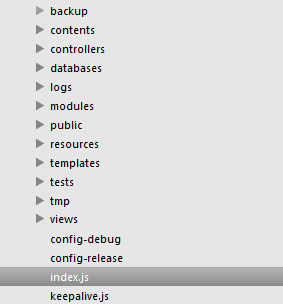

# Partial.js
Partial.js MVC tabanlı bir node.js framework'üdür. Bir çok özelliği barındıran framework hem işlevsel olarak yetenekli hemde öğrenilmesi kolaydır. Framework dahilinde cache desteği, websocket desteği, server events, logging, authorization gibi birçok desteği mevcuttu.

##Kurulum

Framework'ü kurmak için npm kullanabiliyoruz. npm ile kurmak için;

	npm install -g partial.js

Kurulum işlemi tamamlandıktan sonra framework'ü kurmak istediğimiz klasöre geçip;

	partial.js

komutunu çalıştırıyoruz. Bu komut partial.js framework'ün dosya yapısını bulunulan klasöre oluşturup boş js ve örnek dosyaları yerleştiriyor. Bu işlemler tamamlandıktan sonra bulunduğumuz klasörde ki dosya ve klasör yapısı şu şekilde şekilleniyor.



Uygulamamızı çalıştırmak için bağlantıyı sürekli açık tutan keepalive.js dosyasını çalıştıracağız bu bize sistemin herhangi bir hata ile karşılaştığında kesilmemesini sağlamak için oluşturulmuş bir dosya. Şu komudu kullanarak framework'ü çalıştırıyoruz.

	node keepalive 3000

Framework'ümüz hazır ve çalıştı. Şimdi browser adres çubuğuna http://localhost:3000 yazarak framework'ün örnek başlangıç sayfasına ulaşabiliriz.

##Dosya yapısı

Şimdi dosya yapısını inceleyelim. Ana klasörde iki adet dosya bulunmakta. Bunlar config-debug ve config-release bu dosyalar framework'ün ayar dosyaları. Buraya yazdığımız ayarlara hem biz hemde framework bazı yerlerden ulaşıp değerleri okuyabiliyor. Framework ilk kurulduğunda hep debug modda çalışıyor olacaktır bu sebeple Framework config-debug dosyasında ki ayarları dikkate alacaktır. Release modda çalışır ise config-release dosyası dikkate alınacaktır. Config dosyalarının yapısı içerisinde standart olarak framework'ün kullandığı şu ayarlar mevcuttur.

##Framework ayarları
**name:**
framework'ün ad değeridir.

**version:** framework'ün sürüm numarasını almak için ayarlanır.

**secret:** framework içinde session id gibi değerlerin şifrelenmesi için kullanılır.

Aşağıdaki ayarlar framework'ün klasör yerlerini ayarlamak için kullanılır.
```
directory-contents                 : /contents/
directory-controllers              : /controllers/
directory-views                    : /views/
directory-temp                     : /tmp/
directory-templates                : /templates/
directory-resources                : /resources/
directory-public                   : /public/
directory-modules                  : /modules/
directory-logs                     : /logs/
directory-tests                    : /tests/
static-url                         :
static-url-js                      : /js/
static-url-css                     : /css/
static-url-image                   : /img/
static-url-video                   : /video/
static-url-font                    : /font/
static-url-upload                  : /upload/
```

**static-accepts-custom:** Framework'ün varsayılan kabul edilen dosya uzantılarını belirtmek için kullanılır buraya istenen değer virgül ile eklenebilir varsayılan değer: .mp3,.flv
 
**default-layout:** Varsayılan tasarım şekli dosyasıdır. Bu dosya framework ilk oluşturulduğunda views klasöründe yer alır. View şemaları bu dosyaya göre tasarlanır. _layout

**default-request-length:** Varsayılan istek uzunluğunu ayarlamak için gerekli ayar değeridir. Varsayılan olarak 5120 bytetır.

**default-websocket-request-length:** Varsayılan websocket istek uzunluğu değeridir. Varsayılan olarak 5120 bytetır.

**default-request-timeout:** İstek zaman aşımı süresidir. Milisaniye cinsindendir. Varsayılan 3000 milisaniyedir.
 
**allow-gzip:** GZip sıkıştırma kabul edilip edilmeyeceği bu ayardan ayarlanabilir. Varsayılan değer true olarak ayarlanmıştır. NGix web sunucusu kullanıyorsanız bu değeri false yapmanız önerilir.
 
**allow-websocket:** Websocket kullanımını ayarlamak için kullanılan ayardır. Varsayılan true olarak ayarlanmıştır. Eğer socket.io ile kendiniz haberleşme işlemi yapacaksanız bu değeri false yapmanız önerilir.

Aşağıdaki ayarların kullanım yerleriyle ilgili bir bilgim yok. İlerleyen günlerde bu değerler ile ilgili bilgi alırsam açıklama yapacağım.
```
allow-compile-js                   : true
allow-compile-css                  : true
```
Framework'ün debug modda çalışacağı framework.run metodunda ki debug parametresinde ayarlanıyor. Bu kod index.js dosyasında şu şekilde yer alıyor.

``` javascript
var debug = true;
framework.run(http, debug, port);
```
Burada ki debug boolean değerini false olarak ayarlarsak framework release modda çalışacaktır.

Yeri gelmişken belirtelim index.js framework'ümüzün ana kodudur. Her ne kadar node keepalive komutu versekte aslında çalışan ana kod parçası index.js de yer almakta.

Debug mod ve release mod arasında config dosyasından farklı session sürelerinde ve framework'ün cachelemesinde de değişiklikler olmaktadır.

Debug modda her 1 dakika da bir iç servislere ait kaynak cacheleri temizlenmekte ve genel cacheleme özelliği pasif olmaktadır.

Release modda ise Her 20 dakikada bir iç servislere ait kaynak cacheleri temizlenmekte ve framework config dosyalarını tekrar okumakta, her 5 dakikada bir iç servis static cache dosyaları temizlenmekte, her 10 dakikada bir iç servis framework bilgileri sıfırlanmakta, framework view dosyaları için 5 dakikalık, templates dosyaları için 5 dakikalık, contents dosyaları için 5 dakikalık ve tüm static dosyalar için 5 dakikalık cache işlemi yapmaktadır.